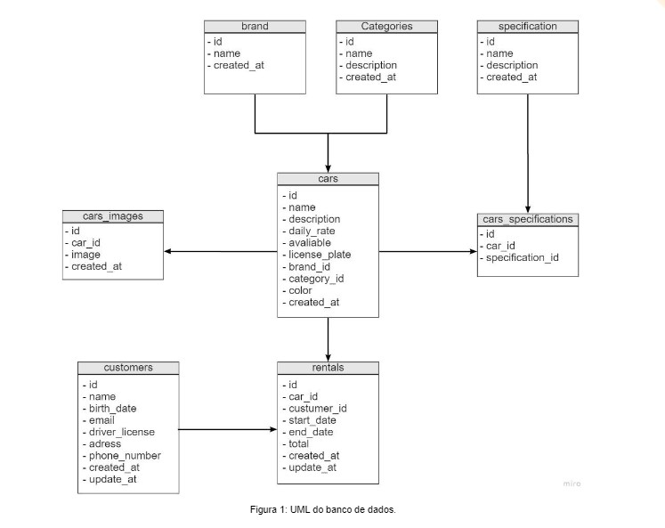

## Teste Prático - Desenvolvedor Java

### Orientações Gerais

Considere o **UML** abaixo para desenvolvimento do seu projeto.

_Criar uma aplicação que permita ao usuário gerenciar uma frota de automóveis e realizar aluguéis. A ideia é que o 
sistema permita realizar cadastros (CRUDS) de carros, especificações, marcas, imagens dos carros e clientes. Além disso, 
é necessário criar uma tela que possibilite realizar o aluguel de carros, sendo necessário avaliar a disponibilidade de 
determinado veículo no período desejado pelo cliente. Construa um software pensando na usabilidade e facilidade de 
atendimento ao cliente final, criando telas que facilitem o fluxo de informações do sistema._

### A aplicação deve contar com:

* Uma tela de cadastros de categorias. Exemplo: **SUV**, **HATCH**, **SEDAN**

* Uma tela de cadastro de especificações. Exemplo: **Automático**, **4 portas**, **bancos de couro**, **teto solar**.

* Uma tela de cadastro de carros onde, será permitido a inclusão de imagens dos veículos, sendo possível visualizá-las 
posteriormente a sua inclusão e no momento da locação.

* Permitir vincular especificações aos veículos

* Permitir vincular uma única marca ao veículo

* Permitir vincular uma única categoria ao veículo.

* Uma tela de cadastro de clientes seguindo o modelo relacional descrito acima

* Não permitir cadastrar mais de um cliente com a  mesma carteira de motorista.

* Uma agenda de disponibilidade, onde o fluxo principal de aluguel de carros funcionará na seguinte forma:

1. O usuário deverá informar o período de aluguel desejado pelo cliente tendo como filtros opcionais especificações e 
categorias.

2. Serão listados os carros disponíveis para o período de locação

3. O usuário deverá escolher o carro desejado, podendo observar suas características.

4. Ao final deverá exibir a ordem de aluguel, permitindo que seja possível ver o valor final da locação. (Considerar o 
valor do aluguel como um valor por dia)

* Criar uma tela onde será possível consultar as locações existentes, permitindo que o usuário possa prorrogar o período 
de locação, caso deseje. Nesse caso não se esqueça de recalcular o valor final da locação.

* Será permitido o cancelamento de um aluguel desde que a data de início da locação não tenha se iniciado.

* Criar a impressão de um relatório nessa tela de consulta (Jasper)

### Requisitos Obrigatórios

* A persistência dos dados deverá ser realizada em um banco **PostgresSQL**.

* Utilizar a versão **Java 8** ou **superior** para a construção da aplicação.

* Utilizar o pacote **SWING** para construção das telas

* Subir os códigos fontes para uma ferramenta de versionamento (**Gitlab**, **Github**, **BitBucket**) em um repositório 
público e enviar para a VR Software

* Realizar a cobertura de testes unitários, fazendo uso do **jUnit**

### Requisitos Opcionais (desejáveis)

* Separar a aplicação em duas: **Client** e **Server**. Construir o server utilizando o **Spring Framework**

* Utilizar **JPA** para a persistência dos dados

* Fazer uso de conceitos **SOLID**

* Utilizar **Clean Architecture**

* Fazer uso de alguma ferramenta para gerenciamento de dependências (**Maven** ou **Gradle**)

* Criar um **DockerFile** no repositório da aplicação server, permitindo que a entrega da **API** seja realizada através de um 
container do docker. Não se esqueça de expor as portas para consumo da aplicação Client.

### Considerações finais

Faça o máximo possível de requisitos que conseguir, não deixe de entregar a prova caso não consiga realizar algo. De 
acordo com o nível de entrega e sua explicação no momento da defesa da aplicação, consideramos o nível do candidato 
(**Júnior**, **Pleno** ou **Sênior**). 
